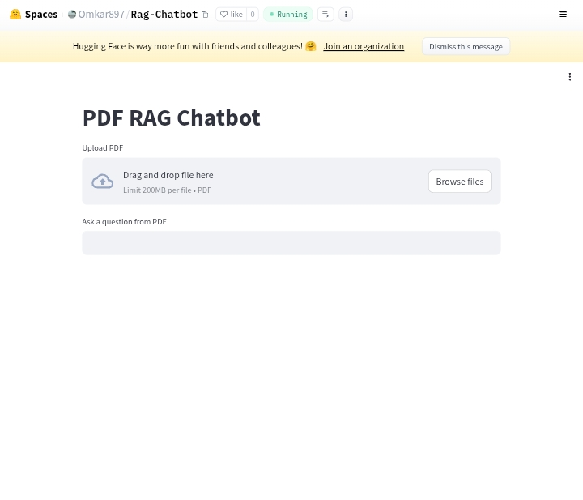
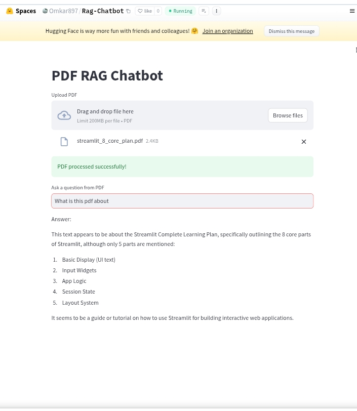

# 📄 PDF RAG Chatbot

A GenAI-powered chatbot that answers questions from uploaded PDF documents using **RAG (Retrieval-Augmented Generation)**.

This application extracts text from PDFs, converts it into embeddings, stores them in a vector database, retrieves relevant chunks based on user queries, and generates accurate answers using an LLM.

## 🚀 Features

- Upload PDF documents
- Extract and process PDF text
- Split text into semantic chunks
- Generate embeddings using Sentence Transformers
- Store embeddings in ChromaDB
- Retrieve relevant context for user queries
- Generate responses using Groq LLM API
- Simple interactive UI with Streamlit

---

## 🛠 Tech Stack

- **Python**
- **Streamlit**
- **PyPDF**
- **Sentence Transformers**
- **ChromaDB**
- **Groq API**

---

## ⚙️ How It Works

1. User uploads a PDF file  
2. Text is extracted from the PDF  
3. Text is split into chunks  
4. Each chunk is converted into embeddings  
5. Embeddings are stored in ChromaDB  
6. User asks a question  
7. Relevant chunks are retrieved  
8. LLM generates an answer using retrieved context  

---

## 📂 Project Structure

```bash
Rag-Chatbot/
│
├── app.py              # Streamlit UI
├── rag.py              # RAG pipeline logic
├── requirements.txt    # Dependencies
└── README.md
```

---

## ▶️ Run Locally

### Clone Repository
```bash
git clone https://github.com/omkarreddy8897/Rag-Chatbot.git
cd Rag-Chatbot
```

### Install Dependencies
```bash
pip install -r requirements.txt
```

### Run Application
```bash
streamlit run app.py
```

---

## 🌐 Live Demo

Hugging Face Space:  
https://huggingface.co/spaces/Omkar897/Rag-Chatbot

---

## 📸 Screenshot

__
__
---

## 📌 Future Improvements

- Support multiple PDFs
- Chat history
- Better chunking strategy
- Source citation for answers

---

## 📄 License

This project is licensed under the MIT License.
